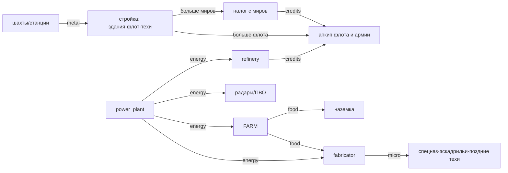

# Сессионная ресурсная экономика — как есть + дизайн

> **Слой:** внутриматчевые ресурсы (бар вверху экрана). Мета-слой — Суверены ◆,
> аукцион, Варранты — живёт отдельно в `economy-roadmap.md` и здесь не трогается.
> **Статус:** модель «как есть» сверена с кодом (main `b300466`, прототипный бандл
> `prototype/src/game.ts` — то, во что реально играют); предложения — кирпичи ECON-1…6.

## 1. Модель как есть (сверено с кодом)

Пять ресурсов: **credits · metal · food · energy · microelectronics**.
Стартовый пакет места: `credits 260 · metal 320 · food 120 · energy 90 · micro 40`.

Механика начисления (economy.ts): спановая, `ставка × Δt` каждый `time.advanced`;
ставка мира = сумма `produces` зданий × богатство мира (`planetType.productionBonus`,
от −25% barren до +45% crystalline) × бонусы фракции/техов (хук `economy.production`),
поверх — гражданский налог. Апкип списывается посуточно; **неуплата не уводит в минус**:
казна клампится в 0, ресурс попадает в `arrears`, и в следующий спан все *производящие*
здания, чей апкип назван в arrears, работают на 50% (**BROWNOUT**). Бомбардировка
замораживает выпуск мира целиком. Стройка ≥50% прогресса уже частично производит.

### Краны (в час, L1/L2/L3)

| Ресурс | Источник | Ставка | Апкип источника |
|---|---|---|---|
| metal | mine (80m) | 12 / 18 / 27 | — |
| metal | metal_station (80m+30c, мёртвые миры) | 30 / 60 / 100 | energy 8 |
| credits | **гражданский налог** (сам по себе) | 100/ч за 1-й обитаемый мир, n-й даёт `100/(1+0.06(n−1))` | — |
| credits | refinery (110m) | 8 | energy 8 |
| credits | tax_office (120m+60c) | ×1.25 к кредитному доходу мира | — |
| food | farm (90m) | 10 / 16 / 24 | energy 6 |
| energy | power_plant (110m+30c) | 14 / 26 / 42 | credits 6 |
| micro | fabricator (180m+100c) | 5 / 11 / 19 | **energy 30 + food 8** |

### Стоки

- **Стройка** — единственный сток metal: здания, корабли (cruiser 60m+20c …
  strike_carrier 320m+160c), техи (120–500c + 80–380m, поздние + 5–60 micro).
- **Апкип юнитов** (в сутки): credits у всех (scout 1 … carrier 12), **food только у
  наземки** (militia/infantry 1, tank 2).
- **Апкип зданий**: energy (radar 6, orbital_aa 6, farm 6, metal_station 8,
  fabricator 30), credits (power_plant 6).
- **Шпионаж** — 150 credits за попытку.
- **Рынок** — p2p-книга (metal/food/energy/micro за credits), эскроу честный,
  **комиссии нет** → ничего не сжигает, только перераспределяет.
- **Ремонт кораблей** у spaceport — **бесплатный**, 5% корпуса в час на стоянке.

### Петли

Ядро петли честное: экспансия → больше налога → больше армии → больше апкипа, и налог
с убыванием (−6% за мир) душит снежный ком. Energy — внутренний «клей» зданий; micro —
гейт хайтека; food — армейский счёт.

## 2. Находки (дыры, проверено кодом)

- **Д1 · Голод и блэкаут ничего не выключают.** BROWNOUT умножает только `produces` —
  а у радара, ПВО, фортов `produces` пуст. Энергодефицит **никак** не наказывает радары
  и ПВО (апкип платится, за неуплату — ничего). Армия без еды и жалованья не голодает:
  food-дефицит бьёт единственного потребителя с выпуском — fabricator. Напряжения нет.
- **Д2 · Ножницы metal/credits.** Приток metal масштабируется мирами и уровнями шахт,
  стоки — разовые (стройка), ремонт бесплатный → к мид-гейму склад metal пухнет.
  Credits наоборот в вечном дефиците: апкип ест постоянно, налог с убыванием (в
  плейтесте казны не хватало даже на шпионаж). Игрок сидит на горе железа без денег.
- **Д3 · Рынок не работает как рынок.** Продавать food/energy почти незачем (апкипы
  микроскопические, дефицит не болит — см. Д1), комиссии нет (не сток), боты не
  торгуют — книга пустует.
- **Д4 · Рассинхрон данных.** Прототипный `data.resources = ['credits','metal']` при
  пяти реально текущих (core-рынок с таким списком отверг бы food/energy/micro —
  прототип спасает свой `MARKET_GOODS`). Канонический `data/*.json` расходится с
  играбельным бандлом и составом (нет refinery/tax_office/farm — **нет источника
  credits вообще**), и цифрами (cruiser 220m против играбельных 60m).
- **Д5 · Энергия без решений.** Игрок всегда строит power_plant ровно под сумму
  апкипов — ни дилемм, ни торговли, ни рисков. Ресурс есть, игры вокруг него нет.

## 3. Роадмап — кирпичи ECON (детально; 1 кирпич ≈ 1 PR ≈ 1 сессия)

> Все точки врезки сверены с кодом. Числа (25% / ×0.5 / 4:1 / 5%) — экспортированные
> константы рядом с `BROWNOUT` (крутятся одной строкой); в данные выносим после
> обкатки на плейтесте, не заранее.

### ECON-1 · Голодная армия `[proto]` — S · ✅ (2026-07-22)

Food в `arrears` владельца → его **наземный** урон ×`HUNGER_MULT` (0.75).

- **Врезка:** новый модуль `hungerModule` в `game.ts` (в `MODULES` после
  `factionModule`) — вклад в хук `combat.damage`. Контракт хука (combat.ts:537):
  args `{battleId, phase, location, attacker, defender}`, где `attacker` — владелец
  бьющей стороны в ОБОИХ вызовах раунда (удар и ответный огонь) — шов чистый.
  Условие: `phase === 'ground'` и `state.players[attacker].arrears?.includes('food')`.
  Орбитальный бой не трогаем: корабли едят кредиты, не пайки.
- **UI:** бейдж 🍽 в панели флота с десантом и на карточке мира с гарнизоном, когда
  владелец в food-arrears (бар уже красит сток красным — PR #257).
- **Тесты:** ground-раунд в food-arrears теряет ровно 25% урона; орбитальная фаза не
  тронута; без arrears ×1; двусторонний бой — голоден только один.
- **Готово, когда:** тесты зелёные + скрин бейджа. Еда — военная цель: сжечь фермы
  врага перед вторжением станет осмысленной операцией.

### ECON-2 · Блэкаут `[proto][core]` — S · ✅ (2026-07-22)

Energy в `arrears` → радары **×0.5** дальности и ПВО **×0.5** урона у этого владельца.

- **Врезка (радар):** `radarMultiplier` (`shared-core/src/state/visibility.ts:149`) —
  уже собирает бонусы фракции/техов; домножить на `BLACKOUT_MULT` при
  `player.arrears?.includes('energy')`. Малая правка ядра-проекции (не kernel):
  чистая функция состояния, детерминизм и реплеи целы; у visibility нет
  хук-пайплайна, поэтому модульного пути честно нет.
- **Врезка (ПВО):** `orbital.ts` — обе AA-ступени (orbital `aaDamage` зданий,
  close-tier гарнизона, orbital.ts:19-33): ×0.5, если владелец мира в energy-arrears.
  Модуль сам читает state — инвариант №3 цел.
- **UI:** кольца радаров на карте тускнеют (альфа ×0.5) + бейдж ⚡ на мирах владельца
  в energy-arrears.
- **Тесты:** visibility.test — дальность ×0.5 под arrears (обе проекции: свои радары
  гаснут, чужие нет); orbital.test — AA-урон ×0.5; без arrears — базовые значения.
- **Готово, когда:** оба штрафа под тестами + визуал. Диверсия по энергосети
  (выбить power_plant бомбардировкой) выключает врагу глаза и щит.

### ECON-3 · Экспресс-ремонт корпуса за metal `[proto][core]` — S · ✅ (2026-07-22)

**Как легло:** `econScrewsModule` (game.ts) + zod-схема `fleet.repair` в SV-1.2.
Отклонение от плана: дополнительно `E_IN_BATTLE` (док в осаде не чинит — паритет с
платным мгновенным ремонтом, который появился раньше кирпича и делит с ним
`missingHull`). Кнопка ремонта — металл-чип «🔧 N⬢» в ХП-ряду карточки (рядом с
золотым чипом мгновенного ремонта за кредиты).

> **Переплавка metal → credits (`resource.smelt`) — ОТКАЧЕНА (2026-07-22).**
> Владелец: искусственный слив по фиксированному курсу — не Bytro-путь. Металл не
> должен копиться мёртвым грузом; его убирают правильной настройкой инкома и стоков
> (см. § ниже про Bytro-баланс), а не разменником. Экспресс-ремонт остался — это
> законный сток металла (латание корпуса стоит железа).

- **Экспресс-ремонт** — действие `fleet.repair {fleetId}`: флот пришвартован к
  СВОЕМУ миру со spaceport (`shipRepair > 0` — сейчас даёт бесплатные 5%/ч);
  мгновенный топ-ап всех стеков по цене `ceil(missingHp / 2)` metal
  (`REPAIR_HP_PER_METAL = 2`). Медленный бесплатный ремонт остаётся. Отказы:
  `E_NO_DOCK` / `E_NO_FUNDS` / `E_NOTHING_TO_REPAIR`. Металл-чип «🔧 N⬢» в
  ХП-ряду карточки флота у дока.
- **Гейт:** схема `fleet.repair` в `actionPayloadSchemas` (+негативы); fuzz-каталог
  подхватывает новый тип автоматически.
- **Тесты:** цена ремонта/клампы/отказы; гейт-схема.
- **Готово, когда:** ремонт работает с телефона, тесты зелёные.

### ECON-4 · Рыночная комиссия 5% `[proto]` — S · ✅ (2026-07-22)

**Как легло:** `MARKET_FEE = 0.05` (game.ts, у `MARKET_GOODS`), net в обеих ветках
`market.take`, событие `market.traded` несёт `fee` (задел под ECON-6). UI: живой
«к получению после комиссии» под формой листинга + подпись «→ N ¤» в бидах книги.
Отмена эскроу — без комиссии (закреплено тестом).

- **Врезка:** исполнение лота (`market.take`, game.ts:2692): продавец получает
  `price × qty × (1 − MARKET_FEE)`, 5% **сгорает** (не переходит никому) — первый
  настоящий сток credits в торговле + анти-спам книги. Симметрично для обеих сторон
  книги (sell-лот и buy-бид: комиссию платит получатель кредитов).
- **UI:** в книге и в форме листинга — «к получению: N» (net после комиссии).
- **Тесты:** комиссия на обеих сторонах; частичное исполнение; эскроу-возврат при
  отмене не облагается.
- **Готово, когда:** тесты зелёные, лента показывает net.

### ECON-5 · Синк бандлов `[data][core]` — M · перед Stage-3

Канонический `data/*.json` живёт в другой экономике, чем играбельный прототип.

- Прототипный `data.resources` → все 5 (сейчас `['credits','metal']` — core-рынок с
  таким списком отверг бы food/energy/micro).
- Canonical: добавить источник credits (refinery + civic-tax-эквивалент или
  tax_office), farm; выровнять цифры юнитов/зданий с играбельными (cruiser 220m в
  canonical против 60m в прототипе — расхождение в разы).
- `data/manifest.json` bump + `schemas.test.ts` версия; **паритет-тест**
  `economy-parity.test.ts`: для ОБОИХ бандлов окупаемость шахты L1 в коридоре
  3–8 ч (§4) — общий smoke, который не даст бандлам разъехаться снова.
- **Готово, когда:** оба бандла проходят паритет-тест; replayDeterminism (шипнутые
  данные) остаётся зелёным.

### ECON-6 · Экономические метрики `[srv]` — S · ✅ (2026-07-22)

**Как легло:** `RoomObservation` += kind `economy` (тип в matchRoom.ts; комната его
не эмитит — источник хостовый); чистый `economySnapshot(state)` в game.ts (казна
копией + `netIncome` + arrears per player, `atTime = state.time`); эмит в
`netserver.onWake` раз в игровой час (`lastEconAt`); JSONL несёт кривые
(`worthLogging` пропускает economy всегда — одна строка в час, не спам),
`MetricsAggregator` — headline: `economy.snapshots` + `arrearsHours` per player.
`market.traded.fee` (ECON-4) уже в `events`-потоке — комиссия считается из него.

- **Врезка:** netserver-пайплайн наблюдений (`RoomObservation` → JSONL +
  `MetricsAggregator`): новый kind `economy` — почасовой срез per player
  `{resources, netPerHour, arrears}` (каданс в onWake, как rearm-каданс патрулей;
  `worthLogging` пропускает раз в час — не спам).
- Сводка на выходе: кривые казны/притока/arrears-часов по игрокам.
- **Готово, когда:** JSONL пишет срезы, следующий плейтест даёт кривые — дальше
  баланс крутим по данным, а не на глаз.

### Последовательность

1. **ECON-1 → ECON-2** — дешёвые, сразу дают еде и энергии «зубы» (закрывают Д1/Д5).
2. **ECON-3 → ECON-4** — ножницы metal/credits (Д2) и оживление рынка (Д3).
3. **ECON-6** — замер на ближайшем плейтесте.
4. **ECON-5** — синк бандлов по обкатанным цифрам, гейт перед Stage-3 (Д4).

### Риски и решения

- **Двойное наказание.** Brownout (×0.5 выпуска) УЖЕ бьёт по производителям; новые
  штрафы бьют по армии/сенсорам. Следить за fabricator: он страдает от обоих
  (food+energy в апкипе) — если плейтест покажет смерть хайтека, ослабить его апкип,
  а не штрафы.
- **Детерминизм.** Все штрафы — чистые функции состояния (`player.arrears`), которое
  уже спаново и детерминированно: реплеи и гибернация целы, golden-RNG не тронут.
- **Сейв-совместимость.** Новых полей состояния нет (только чтение arrears); новые
  действия идут с гейт-схемами (fuzz-свойства подхватят их сами).
- **Каскад ECON-5.** Смена canonical-цифр меняет хэши матчей на шипнутых данных —
  `replayDeterminism` самосогласован (live vs его же реплей) и выдержит; старые
  durable-матчи доигрываются на своей версии данных (пин версии в реплее уже есть).

### Решения от владельца (не блокируют старт)

Дефолты применяю как выше; крутятся одной строкой: голод **−25%**? блэкаут **×0.5**?
комиссия **5%**? Скажи, если чувствуешь другие числа. (Переплавка metal→credits
откачена — металл балансируем инкомом/стоками, а не разменником; см. § про
Bytro-баланс.)

## 4. Балансовая рамка (окупаемость, для проверки цифр)

| Вложение | Отдача | Окупаемость |
|---|---|---|
| mine L1 (80m) | 12 m/ч | ~6.7 ч |
| mine L2 (+140m) | +6 m/ч | ~23 ч |
| metal_station L1 (80m+30c) | 30 m/ч | ~2.7 ч (риск: мёртвый мир на отшибе) |
| refinery (110m) | 8 c/ч − 8 energy | ~14 ч⁺ (плюс доля power_plant) |
| power_plant L1 (110m+30c) | 14 e/ч − 6 c/сут | окупается только потребителями |
| fabricator L1 (180m+100c) | 5 micro/ч − 30 e − 8 food | самое дорогое содержание в игре |
| tax_office (120m+60c) | +25% credits мира | ~зависит от мира; на столице — часы |

Правило большого пальца, которое держим при любой правке цифр: **здание-кран окупается
за 3–8 часов реального времени** (сессия живёт днями), станции на мёртвых мирах —
быстрее, но дальше и уязвимее; **содержание hi-tech ≥ ⅓ его выпуска в эквиваленте** —
чтобы отключение снабжения врагом было ударом.

## 4a. Плейтест 2026-07-22 (ECON-6 кривые, headless AI self-play)

Инструмент: `prototype/econplaytest.mjs` — гоняет матч на РЕАЛЬНОМ ядре той же серверной
ИИ-петлёй, что netserver (`aiOrders`), headless и детерминированно, и каждый игровой
час снимает `economySnapshot` (тот же срез, что ECON-6 пишет в JSONL). Прогон: 4 стороны,
3 сида. Два сценария — война (`expand`, кончается вылетом за ~8 дней) и мирные строители
(`defend`, полные 40 дней — чистое устойчивое состояние).

**Медианный запас на игрока (мирный, 40 дней):**

| день | metal | credits | food | energy | micro |
|---|---|---|---|---|---|
| 1 | 192 | 2.9k | 307 | 333 | 40 |
| 20 | ~210 | ~62k | ~5.1k | ~6.7k | 40 |
| 40 | 192 | 115k | 10k | 13k | 40 |

**Диагноз (переворачивает исходную гипотезу «гора железа / пустая казна», Д2):**

- **Металл сбалансирован** — плоский ~200 весь матч. Он связывающее ограничение: всё
  строится из него, домашняя шахта (12/ч) держит выпуск ~5 крейсеров/день. Металл НЕ
  трогаем — «горы железа» в данных нет.
- **Кредиты — главный перекос**: копятся ~2.8k/день/мир без предела. Кран civicTax
  (100/ч ×1.25 tax_office) + refinery 8/ч ≈ 3.2k/день; стоки (косты/апкип юнитов) —
  крохи. Кредиты почти не на что тратить.
- **Еда и энергия** тоже перепроизводятся (~250 и ~320/день).
- **Микроэлектроника — мёртвый контент**: 40 весь матч (ИИ фабрикатор не строит).
- **arrears за 40 дней — 0** у всех: штрафы ECON-1/2 в норм-игре не срабатывают (что
  подтверждает: дефицита нет, всё в профиците).

**Вывод для настройки (по-Bytro):** кредиты должны стать «деньгами», которых всегда
впритык (мобилизация + содержание армии выкачивают казну), а не мёртвой кучей —
throttle крана и/или усиление стоков; еда/энергия — мягкий трим перепроизводства; металл
оставить.

**ECON-7 (внедрено 2026-07-22) — планетарная экономика.** По директиве владельца
модель производства переработана: КАЖДЫЙ мир пассивно даёт все 4 базовых ресурса
(metal/credits/food/energy) с ПЕРЕКОСОМ по типу планеты (`planetTypes[t].baseOutput`,
Bytro-модель провинций); микроэлектроника из пассива ИСКЛЮЧЕНА — только фабрикатор.
Здания теперь надстройка над пассивом. civic-tax срезан 100→20/ч (миры сами дают
кредиты). Микро оживлена: фабрикатор в строй-цепочке ИИ + крейсер/осадник стоят micro
(3/4) — её надо добывать и она тратится. Повторный прогон харнесса (40 дней, мирные):

| день | metal | credits | food | energy | micro |
|---|---|---|---|---|---|
| 1 | 234 | 1.0k | 223 | 148 | 28 |
| 40 (до ECON-7) | 192 | **115k** | 10k | 13k | **40 (мёртв)** |
| 40 (после ECON-7) | 210 | **16k** (плато) | 4.7k | **1.1k** | **4.1k (живой)** |

Итог: кредитный флуд снят (115k→16k, выходит на плато), энергия почти плоская
(13k→1.1k), микро производится И тратится (мёртвые 40 → живой оборот). Металл ровный.
Остаточный подъём еды (~110/день) — артефакт бота-флотоводца: еду ест только наземная
армия, которую боты не строят; у живого игрока с десантом сток есть. Следующий
возможный кирпич — civic-food (население ест еду), чтобы еда была тугой и без армии.

## 5. Чего сознательно НЕ делаем

- **Не добавляем шестой ресурс.** Пять уже дают все нужные оси (стройка / содержание /
  армия / инфраструктура / хайтек); новые оси — это данные внутри существующих.
- **Не делаем минусовые балансы.** Кламп в 0 + arrears + штрафы (ECON-1/2) честнее
  долговой спирали и уже реализован детерминированно.
- **Не превращаем рынок в NPC-магазин.** Никаких NPC-разменников ресурс↔кредиты по
  фиксированному курсу (переплавка была такой и откачена) — торговля между людьми
  остаётся единственным курсом; излишки уходят на рынок, а не в автомат.
- **Ядро не трогаем**: все кирпичи — модули/данные/хуки (инвариант №3), детерминизм и
  спановое начисление не меняются.
